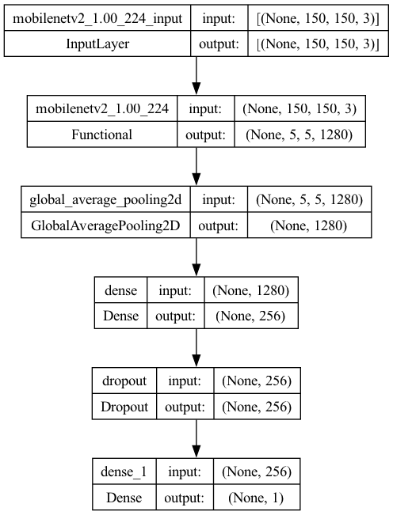
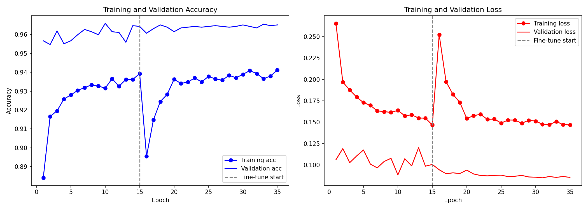

## Binary Classification using CNNs: Dogs vs Cats

A deep learning project for binary image classification (dogs vs cats) using **MobileNetV2 transfer learning**, achieving **96.9% test accuracy**.

### Model

The current model uses **MobileNetV2** pretrained on ImageNet as a feature extractor, with a custom classification head:

MobileNetV2 (frozen) → GlobalAveragePooling2D → Dense(256, relu) → Dropout(0.5) → Dense(1, sigmoid)

Trained on 20,000 images (80/10/10 split) with data augmentation.

| Metric | Value |
|---|---|
| Test accuracy | **96.9%** |
| Validation accuracy | 96.5% |
| Test loss | 0.0808 |
| Parameters | 2.6M |
| Model size | 17MB |

### Architecture



### Training Curves



## Prerequisites

* **Python** 3.9+
* **TensorFlow** 2.14+
* **OpenCV** 4.8+
* **Flask** 3.0+

## How to run

* Create a virtual environment and install dependencies

```
python3 -m venv .venv
source .venv/bin/activate
pip install -r requirements.txt
```

* Download the dataset and place it in `data/` (should contain `train/`, `validation/`, `test/` subdirectories). Link to the training dataset is provided in `src/train/README.md`.

* To train the model:

```
python src/train/dogs_and_cats.py
```

* Start the server:

```
python src/server/server.py
```

* Open http://localhost:5000 in your browser to use the drag-and-drop UI, or use curl:

```
curl -X POST -F 'image=@src/test/1510.jpg' http://localhost:5000/api/class_pred
```

* To evaluate the model on the test dataset:

```
python src/test/test.py
```

# Contributing

Feel free to clone it and make changes to it. Pull requests are welcome.

# Author

Navneet Sharma

# Acknowledgements

Deep Learning for Python Book, Keras Documentation etc.
