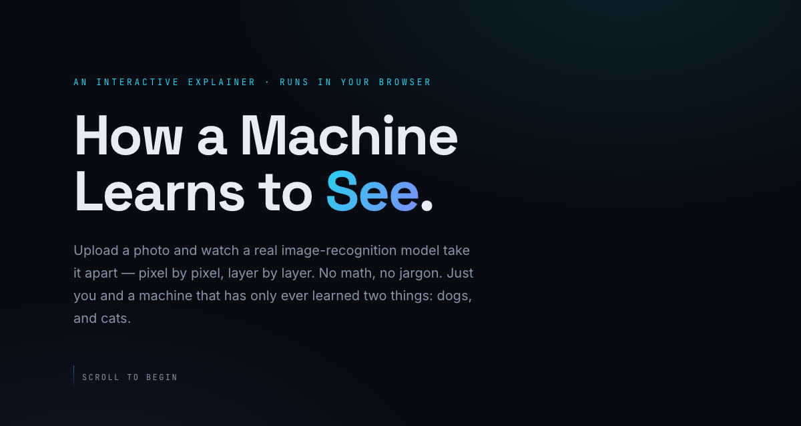
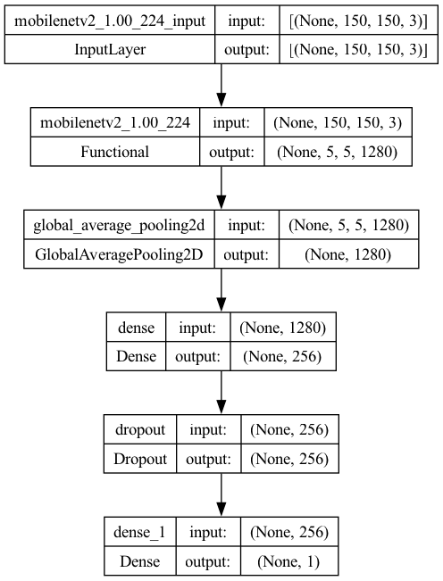
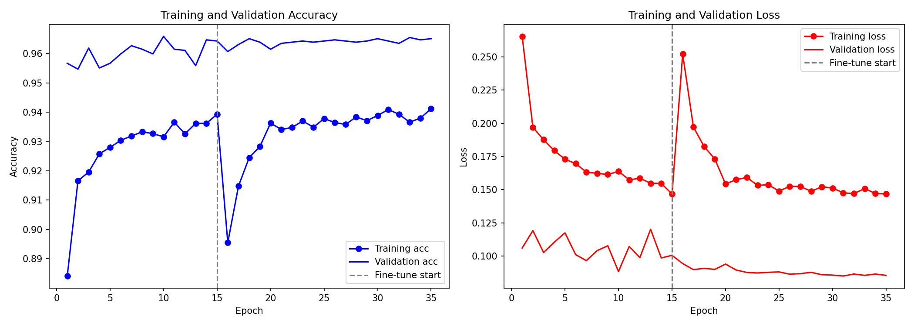

## Binary Classification using CNNs: Dogs vs Cats

A deep learning project for binary image classification (dogs vs cats) using **MobileNetV2 transfer learning** with two-phase training, achieving **97.0% validation accuracy**.

## 🔍 Interactive explainer — "How a Machine Learns to See"

**▶︎ Live: https://navsha.github.io/dogs-vs-cats/**

[](https://navsha.github.io/dogs-vs-cats/)

This same trained model also powers a jargon-free explainer that turns the classifier into a teaching instrument for non-technical readers. It's a **dark, scroll-driven exhibit** (a light editorial version lives at [`/editorial.html`](https://navsha.github.io/dogs-vs-cats/editorial.html)). The model is converted to **TensorFlow.js** and runs **entirely in the browser** — no server, no API. Upload your own photo and watch it flow through five chapters:

1. **A photo is just numbers** — your image shrunk to the 150×150 grid the model receives; hover any pixel to read its RGB values.
2. **The machine looks for patterns** — three real intermediate layers (edges → textures → patterns) visualised live on your photo.
3. **Where is it looking?** — an occlusion-sensitivity attention map (slide a patch, measure the confidence drop) plus a plain-English readout.
4. **How did it learn?** — the *actual* training run narrated as a story, drawn from the real TensorBoard logs (the climb, the plateau, the fine-tuning jump to 97%, the early stop).
5. **Break it** — feed it a fox, a car, your face, or pure TV static and watch it answer with confident nonsense — the lesson every PM needs about AI's limits.

The explainer is a self-contained static site in [`docs/`](docs/). To build its assets from the trained model:

```
source .venv-tfjs/bin/activate          # an env with tensorflowjs (see below)
python src/export/export_web_assets.py   # activation sub-model + training/prediction JSON
tensorflowjs_converter --input_format=keras model/cats_and_dogs_mobilenet.h5 docs/model
tensorflowjs_converter --input_format=keras model/activation_model.h5        docs/model-activations
```

> Note: `tensorflowjs` pulls a TF/Keras stack that can clash with the training env, so install it in a **separate** venv pinned to the training versions: `python3 -m venv .venv-tfjs && .venv-tfjs/bin/pip install "tensorflow==2.15.1" "tensorflowjs==4.17.0"`.

Preview locally with any static server: `cd docs && python3 -m http.server 8000` → http://localhost:8000.

### Model

The model uses **MobileNetV2** pretrained on ImageNet with a custom classification head, trained in two phases:

1. **Feature extraction** (15 epochs) — MobileNetV2 base frozen, only the classification head trains
2. **Fine-tuning** (20 epochs) — Last 30 MobileNetV2 layers unfrozen with 10x lower learning rate

MobileNetV2 → GlobalAveragePooling2D → Dense(256, relu) → Dropout(0.5) → Dense(1, sigmoid)

Trained on 20,000 images (80/10/10 split) with data augmentation.

| Metric | Phase 1 (frozen base) | Phase 2 (fine-tuned) |
|---|---|---|
| Validation accuracy | 96.5% | **97.0%** |
| Test accuracy | 96.9% | 96.1% |
| Best val_loss | 0.0849 | **0.0765** |
| Parameters | 2.6M (330K trainable) | 2.6M (1.6M trainable) |
| Model size | 17MB | 17MB |

### Architecture



### Training Curves



## Prerequisites

* **Python** 3.9+
* **TensorFlow** 2.14+
* **OpenCV** 4.8+
* **Flask** 3.0+

## How to run

* Create a virtual environment and install dependencies

```
python3 -m venv .venv
source .venv/bin/activate
pip install -r requirements.txt
```

* Download the dataset and place it in `data/` (should contain `train/`, `validation/`, `test/` subdirectories). Link to the training dataset is provided in `src/train/README.md`.

* To train the model:

```
python src/train/dogs_and_cats.py
```

* Start the server:

```
python src/server/server.py
```

* Open http://localhost:5000 in your browser to use the drag-and-drop UI, or use curl:

```
curl -X POST -F 'image=@src/test/1510.jpg' http://localhost:5000/api/class_pred
```

* To evaluate the model on the test dataset:

```
python src/test/test.py
```

# Contributing

Feel free to clone it and make changes to it. Pull requests are welcome.

# Author

Navneet Sharma

# Acknowledgements

Deep Learning for Python Book, Keras Documentation etc.
